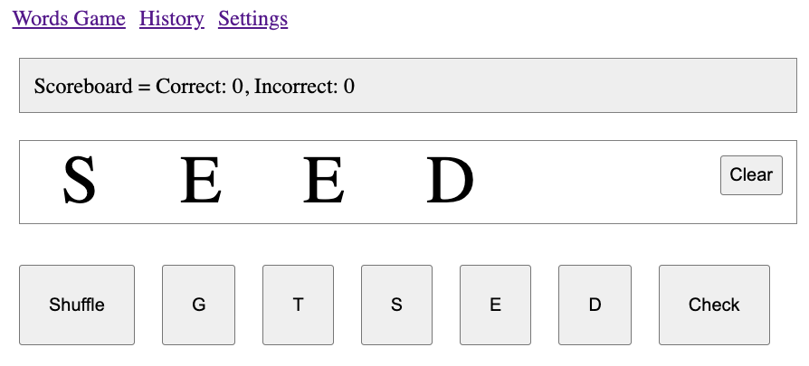
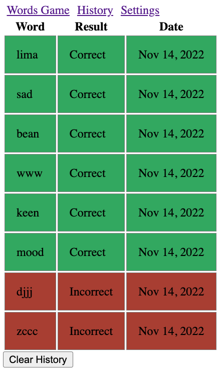
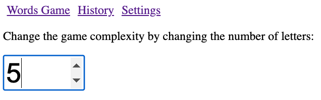

[](https://classroom.github.com/a/z8gbpdnf)
[](https://classroom.github.com/open-in-codespaces?assignment_repo_id=11327942)
# CS569 - Words Game

You will be building a Word Gessing game with Angular Framework. Please refer to
the demo for how the game works.

### Backend Preparation

To start, download the provided code for the backend server, install the
dependencies `npm i`, then head to
[Oxford Dictionaties API](https://developer.oxforddictionaries.com/) and get
your personal API key, choose the free introductory package. Update your `.env`
file with the your application ID and Key.

```json
APP_ID="INSERT_YOUR_APP_ID_HERE"
APP_KEY="INSERT_YOUR_APP_KEY_HERE"
```

Start your backend server `npm run start` and make sure it is listening to port
`3000`.\
This web server accepts requests to:

```http
GET /check/:word
```

And returns the following response:

```json
{
  "success": boolean,
  "data": {
    "valid": boolean
  }
}
```

The `valid` property indiciates whether the provided word is valid or not.

### Frontend Development

Create an Angular project that navigates the following components:

- `WordsComponent` _(default route)_
- `HistoryComponent`
- `SettingsComponent`

All three components share one reactive global state in a form of `Signal`,
which is always synched with the `localStorage`. The state has the following
structure/types and default value:

```ts
export enum GUESS_RESULT {
  Correct = "Correct",
  Incorrect = "Incorrect",
}

export interface ITry {
  word: string;
  result: GUESS_RESULT;
  timestamp: number;
}

export interface IState {
  complexity: number;
  win_count: number;
  loss_count: number;
  logs: ITry[];
}

export const INITIAL_STATE = {
  complexity: 5,
  win_count: 0,
  loss_count: 0,
  logs: [],
};
```

#### `WordsComponent`

- The `WordsComponent` show the scoreboard win and loss counts from the state.
- A placeholder for the answer:
  - A button to clear the answer.
  - When any letter is clicked, the letter will be removed.
- Button Controls: "Shuffle" + (Letters * complexity) + "Check".
  - The "Shuffle" button would select a new set of random letters without
    affecting the scoreboard (refer to the method below).
  - The number of letters buttons is based on the game complexity.
  - The "Check" button would send a request to the backend server and verify the
    selected word, which will affect the scoreboard and logs the results to the
    state.

<p align="center">
  
</p>

The following helper method returns an array of unique random letters, where
length is the game complexity:

```ts
private getRandomLettersArrayOf(length: number): string[] {
  let result: string[] = [];
  const characters = 'ABCDEFGHIJKLMNOPQRSTUVWXYZ';
  while (result.length < length) {
    const letter = characters.charAt(Math.floor(Math.random() * characters.length))
    if (!result.includes(letter)) result.push(letter)
  }
  return result;
}
```

#### `HistoryComponent`

This component shows the state `logs`. A color directive is applied on each log
to change its background color to red/green based on the result.

<p align="center">
  
</p>

#### `SettingsComponent`

This components changes the game complexity to display different number of
letter-buttons. The complexity must be a value between 3 and 26, an error must
be displayed when the value is outside of that range.

<p align="center">
  
</p>

### Notes

- Submission deadline is 1:00 PM, please submit your work regardless if you
  finished or not.
- Completing the requirement will provide immunity in the final exam in three
  tiers:
  - Full implementation: You may wave questions up to 15 points from the final
    exam. (tier capacity: 3 students)
  - (Words and History) or (Words and Settings): You may wave questions up to 10
    points from the final exam. (tier capacity: 3 students)
  - Words only: You may wave questions up to 5 points from the final exam. (no
    capacity)
- Please note that code must meet the requirements to be accepted. Send me a message on Teams and specify which tier you are
  applying to.

### Code Honor Submission Policy

_Remember to respect the code honor submission policy. All written code must be original. Presenting any code as one’s own work when it came from another source
is plagiarism, which includes any matching patterns and code snippets, and will affect your grade. The use of AI is not permitted in this assignment. For more details, check the full course policies in the syllabus._
